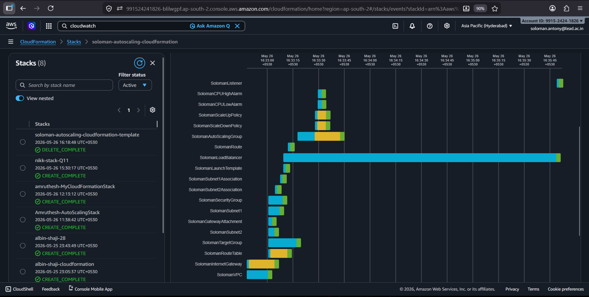
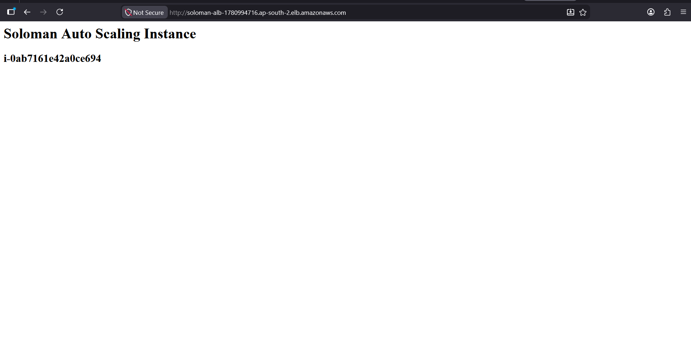
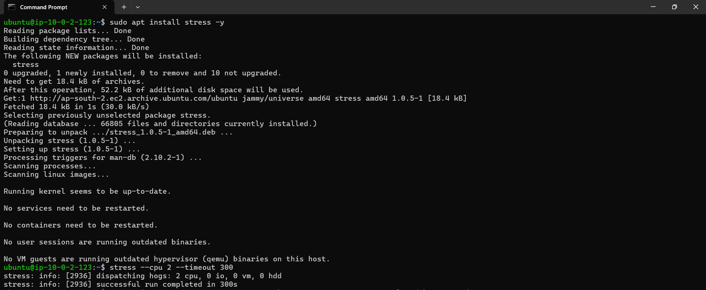
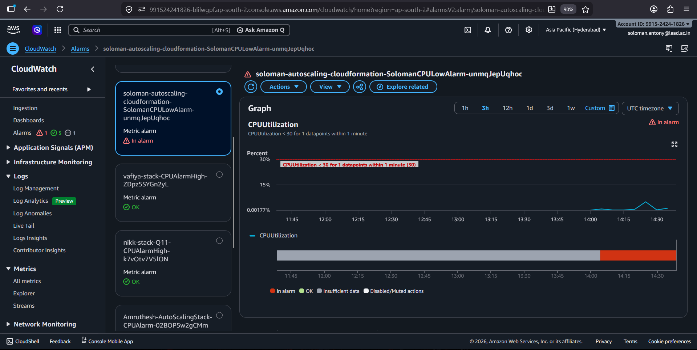
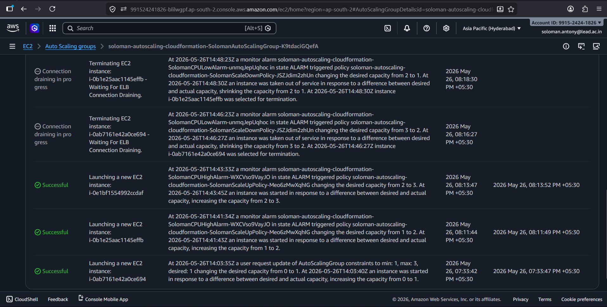
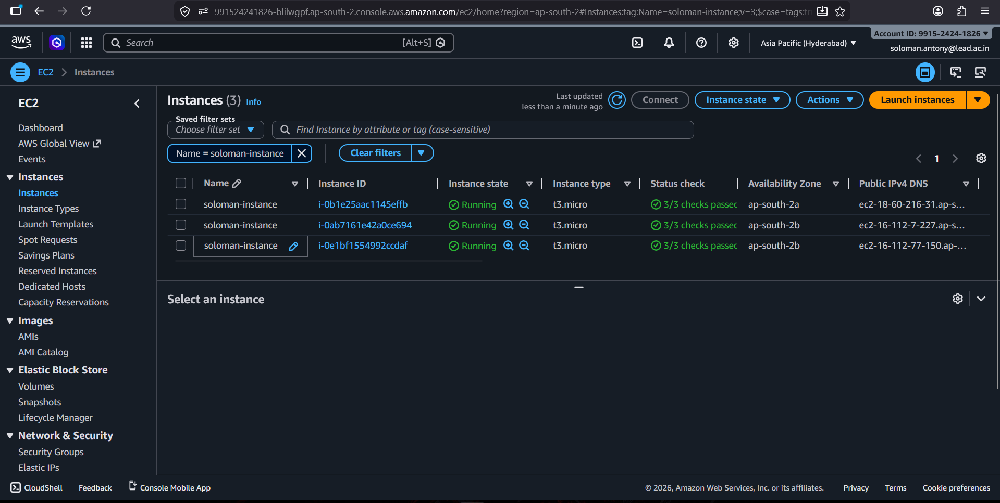

````md
# AWS CloudFormation Auto Scaling Project

## 📌 Project Overview

This project provisions a complete AWS infrastructure using CloudFormation.

The infrastructure includes:

- Custom VPC
- Internet Gateway
- Public Subnets
- Route Tables
- Security Group
- EC2 Launch Template
- Application Load Balancer (ALB)
- Target Group
- Auto Scaling Group (ASG)
- CloudWatch CPU Alarms
- Auto Scaling Policies

The project automatically scales EC2 instances based on CPU utilization while serving a web application behind an Application Load Balancer.

---

# 🏗️ Architecture

```text
                    Internet
                        |
                        v
               Application Load Balancer
                        |
          --------------------------------
          |                              |
          v                              v
     EC2 Instance                   EC2 Instance
        (ASG)                          (ASG)
          \                              /
           \                            /
            ------ Auto Scaling -------
                        |
                 CloudWatch Alarms
```

---

# ☁️ AWS Services Used

| Service | Purpose |
|---|---|
| AWS CloudFormation | Infrastructure as Code |
| Amazon VPC | Networking |
| Amazon EC2 | Virtual Servers |
| Auto Scaling Group | Automatic scaling |
| Application Load Balancer | Traffic distribution |
| Amazon CloudWatch | Monitoring and alarms |
| Security Groups | Firewall rules |

---

# ✨ Features

- Fully automated infrastructure deployment
- Multi-AZ architecture
- Internet-facing Application Load Balancer
- Auto Scaling based on CPU utilization
- Dynamic instance creation and termination
- Apache web server setup using User Data
- Displays EC2 Instance ID on webpage

---

# 📂 Project Structure

```text
.
├── screenshots/
│   ├── 3-instance-running.png
│   ├── autoscaling-group-activity.png
│   ├── in-alarm.png
│   ├── stack-created.png
│   ├── stress.png
│   └── website.png
├── template.yml
└── README.md
```

---

# 🌐 Infrastructure Details

## VPC Configuration

| Component | Value |
|---|---|
| VPC CIDR | 10.0.0.0/16 |
| Subnet 1 | 10.0.1.0/24 |
| Subnet 2 | 10.0.2.0/24 |
| Region | ap-south-2 |
| Availability Zones | ap-south-2a, ap-south-2b |

---

## 🔐 Security Group Rules

| Port | Protocol | Purpose |
|---|---|---|
| 22 | TCP | SSH Access |
| 80 | TCP | HTTP Access |

---

## 🚀 Launch Template Configuration

| Setting | Value |
|---|---|
| AMI | Ubuntu AMI |
| Instance Type | t3.micro |
| Web Server | Apache2 |
| Key Pair | solo |

User Data automatically:

- Starts Apache
- Enables Apache service
- Creates a simple webpage
- Displays EC2 Instance ID

---

# 📈 Auto Scaling Configuration

| Setting | Value |
|---|---|
| Minimum Instances | 1 |
| Desired Instances | 1 |
| Maximum Instances | 3 |

---

# ⚡ Scaling Policies

## Scale Up Policy

- Triggered when CPU usage is greater than 70%
- Adds 1 new EC2 instance

## Scale Down Policy

- Triggered when CPU usage is less than 30%
- Removes 1 EC2 instance

---

# 📊 CloudWatch Alarms

| Alarm | Condition |
|---|---|
| High CPU Alarm | CPU > 70% |
| Low CPU Alarm | CPU < 30% |

---

# 🖼️ Screenshots

## Stack Created



---

## Website Running



---

## Stress Test



---

## CloudWatch Alarm Triggered



---

## Auto Scaling Activity



---

## 3 Instances Running



---

# 👨‍💻 Author

**Soloman Antony**

Cloud & DevOps Enthusiast
````
